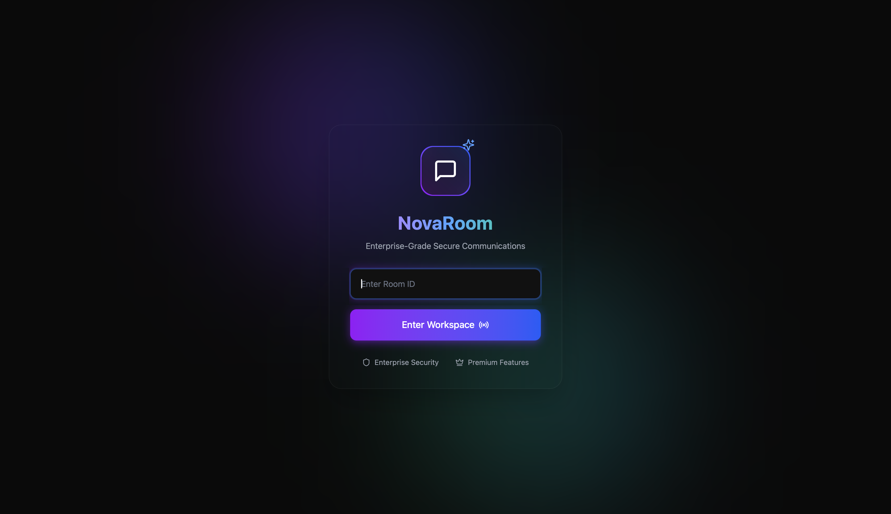
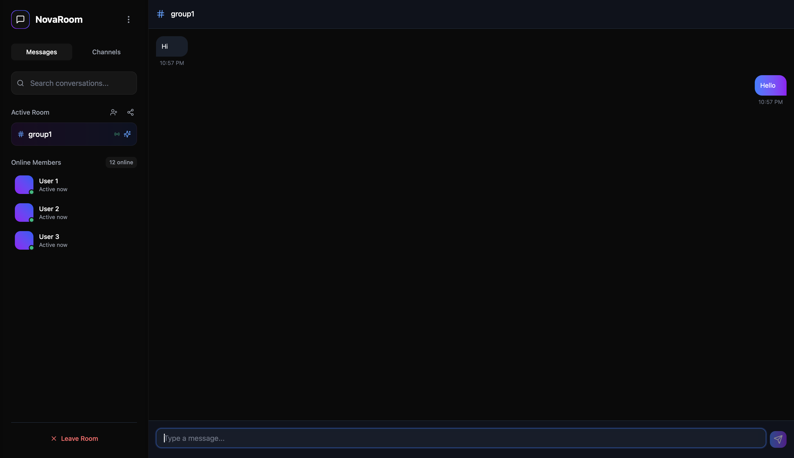

# NovaRoom - Real-Time Chat Application

NovaRoom is a modern, real-time chat application built with a focus on secure and seamless communication. It features a beautiful UI, real-time messaging, and a responsive design for both desktop and mobile devices.

---

## Screenshots

<div align="center">
  
  
</div>

---

## Live Demo

Check out the live demo of NovaRoom: [Live Demo](https://your-live-host-link.com)

---

## Features

- Real-time messaging using WebSocket.
- Secure and private chat rooms.
- Responsive design for desktop and mobile.
- Beautiful gradient UI with smooth animations.
- Fixed sidebar and topbar for better usability.

---

## Setup Instructions

### Prerequisites

- Node.js (v16 or higher)
- npm (v8 or higher)

### Running the Backend

Navigate to the backend directory:

```bash
cd backend
```

Install dependencies:

```bash
npm install
```

Start the backend server:

```bash
npm run dev
```

### Running the Frontend

Navigate to the frontend directory:

```bash
cd frontend
```

Install dependencies:

```bash
npm install
```

Start the frontend development server:

```bash
npm run dev
```

### Environment Variables

Create a `.env.local` file in the root of the project and add the following:

```env
VITE_BACKEND_URL=<backend URL>
```

---

## Technologies Used

- **Frontend**: React, Tailwind CSS, Lucide Icons  
- **Backend**: Node.js, WebSocket  
- **Tools**: Vite, npm  

## Contributing

Contributions are welcome! If you'd like to contribute, please follow these steps:

1. Fork the repository.
2. Create a new branch:
   ```bash
   git checkout -b feature/YourFeatureName
   ```
3. Commit your changes:
   ```bash
   git commit -m 'Add some feature'
   ```
4. Push to the branch:
   ```bash
   git push origin feature/YourFeatureName
   ```
5. Open a pull request.

## License

This project is licensed under the MIT License. See the LICENSE file for details.

## Contact

For any questions or feedback, feel free to reach out:

- **Email**: [your-email@example.com](mailto:your-email@example.com)  
- **GitHub**: [Your GitHub Profile](https://github.com/your-profile)

## Additional Notes

### Screenshots
Add your screenshots in the `screenshots` folder and update the paths in the `` tags.

### Live Demo
Replace `https://your-live-host-link.com` with your actual live host link.

### Environment Variables
Ensure you set up `.env.local` with the required variables.

---

Enjoy chatting on NovaRoom! 🚀

